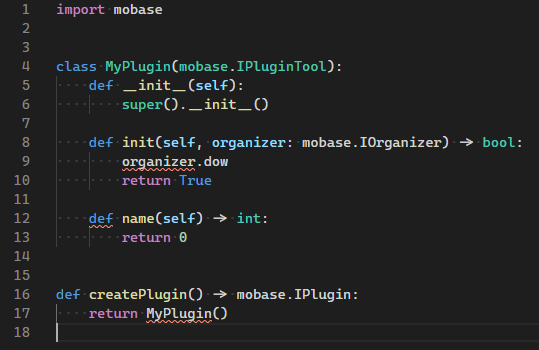
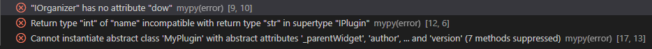

Setting up the environment
==========================

This page will get you started for creating a MO2 python plugin. If you have troubles getting
everything setup, feel free to come by our discord server at `https://discord.gg/cYwdcxj <https://discord.gg/cYwdcxj>`_.

Required tools
--------------

It is possible to write a MO2 python plugin using any text editor, but this guide will focus on
`Visual Studio Code <https://code.visualstudio.com/>`_.
This guide assumes that:

- You have `Visual Studio Code <https://code.visualstudio.com/>`_ installed with the
  `Python extension <https://marketplace.visualstudio.com/items?itemName=ms-python.python>`_.
- You have Python installed: https://www.python.org/downloads/.

  - It is recommended but not mandatory to use the Python version that is used by MO2.
    You can check the ``pythonXX.dll`` in the MO2 installation folder to find the Python version used by MO2 (``python38.dll`` means Python 3.8).
- You obviously need a valid MO2 installation: https://github.com/modorganizer2/modorganizer/releases

  - This guide is written for MO2 ≥ 2.3.0.

**Note:** In the following, I will refer to the MO2 installation directory as ``$MO2DIR``. So if you
installed MO2 at ``C:\MO2`` and you are asked to copy a file to ``$MO2DIR/plugins``, it refers to ``C:\MO2\plugins``.

Preparation
-----------

**Note:** This part is optional but highly recommended if you want a proper environment to work with.
Everything here is written to be as simple as possible but you can of course adapt it to your preferences: use a python virtual
environment, use workspace settings instead of global ones, etc.

1. Get the ``mobase`` stubs
...........................

``mobase`` is the MO2 Python module. The module is written in C++ and thus cannot be read directly by tools such
as ``flake8`` or ``mypy``.
Instead, we provide `stubs <https://stackoverflow.com/questions/59051631/what-is-the-use-of-stub-files-pyi-in-python>`_
which can be used for auto-completion or type-checking.

The stubs for ``mobase`` are available at https://github.com/ModOrganizer2/pystubs-generation/tree/master/stubs.
You want to download the ``mobase.pyi`` file in the folder corresponding to your MO2 version and put it under ``$MO2DIR/plugins/data``.

**Note:** It is possible to put the stubs in a different location, but we are going to use ``$MO2DIR/plugins/data`` for PyQt5,
so we might as well use it for the stubs.

2. Configure Visual Studio Code for ``mobase``
..............................................

We are going to configure Visual Studio Code to have auto-completion and linting (error and type checking)
for the MO2 Python module.
Open ``settings.json`` (Ctrl+Shift+P, then "Open Settings (JSON)"), and add the following entries:

.. code-block:: json-object

    "python.linting.enabled": true,
    "python.linting.mypyEnabled": true,
    "python.linting.flake8Enabled": true,
    "python.autoComplete.extraPaths": [
        "$MO2DIR\\plugins\\data",
    ]

3. Configure ``mypy`` to find the ``mobase`` stubs
..................................................

There are multiply way to configure ``mypy``:

1. You can create a ``mypy.ini`` file somewhere containing:

.. code-block:: ini

    [mypy]
    mypy_path = $MO2DIR\plugins\data

And then add the following to ``settings.json`` (with the correct path):

.. code-block:: json-object

    "python.linting.mypyArgs": [
        "--config-file=path-to-mypy.ini",
    ]

2. You can set the ``MYPYPATH`` environment variable to ``$MO2DIR\plugins\data`` (this requires
restarting VS code).

4. [Optional] Automatically reload plugins during development
.............................................................

This section is optional and requires you to already have written a "working"
plugin (a plugin that MO2 can load).

Since MO2 2.4 alpha 6, a new command has been added to ``ModOrganizer.exe`` to
reload plugins during execution.
If your plugin is named "My Plugin", you can use the following command to reload
it while MO2 is running:

.. code::

    $MO2DIR\ModOrganizer.exe reload-plugin "My Plugin"

If you are using Visual Studio Code, you can send this command to MO2 automatically
after saving files from your project.

1. Create a "reload plugin" task in Visual Studio Code (Ctrl+Shift+P  then
   ``Tasks: Configure task`` or open ``.vscode/tasks.json``) using the following
   snippet (replace the name and directory as needed):

.. code:: javascript

    // .vscode/tasks.json
    {
        // See https://go.microsoft.com/fwlink/?LinkId=733558
        // for the documentation about the tasks.json format
        "version": "2.0.0",
        "tasks": [
            {
                "label": "reload plugin",
                "type": "shell",
                "command": "$MO2DIR/ModOrganizer.exe",
                "args": [
                    "reload-plugin", "My Plugin"
                ]
            }
        ]
    }

2. Install the `Trigger Task on Save <https://marketplace.visualstudio.com/items?itemName=Gruntfuggly.triggertaskonsave>`_
   extension from Visual Studio Code marketplace.

3. Add the following to your Visual Studio Code settings (``.vscode/settings.json``)

.. code:: javascript

    // .vscode/settings.json
    {
        "triggerTaskOnSave.on": true,
        "triggerTaskOnSave.tasks": {
            "reload plugin": [
                "*.py"
            ]
        }
    }

Testing the setup
-----------------

Create a new Python file in Visual Studio Code, and paste the following content (if you create
the file in ``$MO2DIR\plugins``, do not forget to delete it after since it is not a valid
plugin):

.. code-block:: python

    import mobase

    class MyPlugin(mobase.IPluginTool):
        def __init__(self):
            super().__init__()

        def init(self, organizer: mobase.IOrganizer) -> bool:
            organizer.dow  # (1)
            return True

        def name(self) -> int:
            return 0

    def createPlugin() -> mobase.IPlugin:
        return MyPlugin()

If your setup is valid, here is what you should have.

- You should see the following (with the errors underlined):

- If you press ``Ctrl+Space`` after ``.down`` (1), you should see the following
  meaning that auto-complete is working:

.. image:: images/check-setup-2.png

- In the error window (click |error-window| on the status bar), you should see
  the 3 following errors:

If everything is as above, you can delete the test file and move on to writing
your own plugin!

.. |error-window| image:: images/error-window.png
